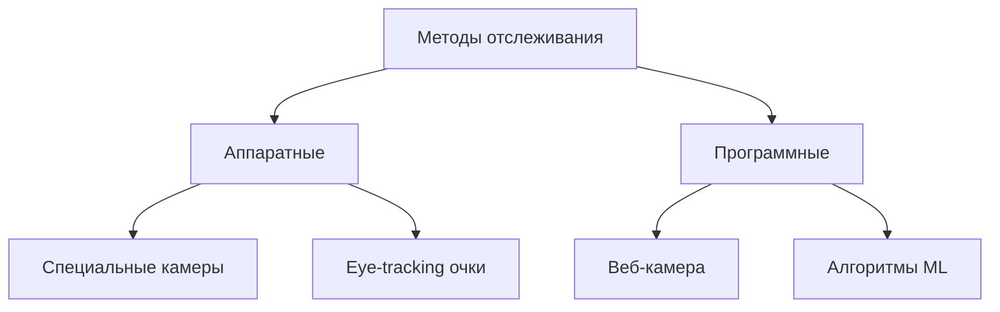
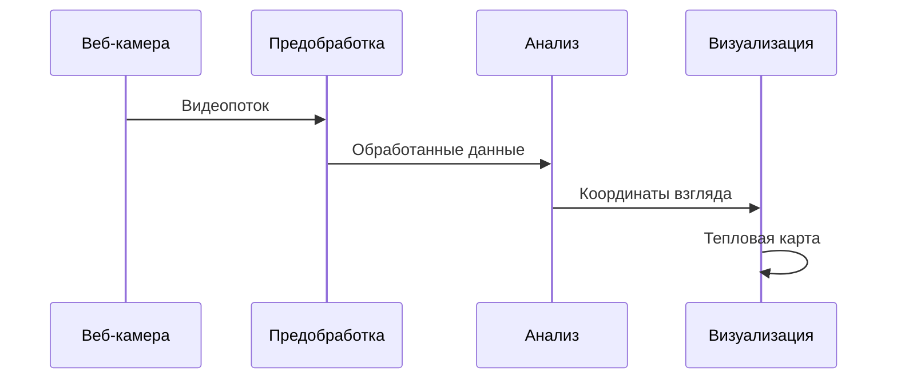

---
# You can also start simply with 'default'
theme: seriph
# random image from a curated Unsplash collection by Anthony
# like them? see https://unsplash.com/collections/94734566/slidev
background: https://source.unsplash.com/collection/94734566/1920x1080
# some information about your slides (markdown enabled)
title: Анализ предметной области
info: |
  Анализ предметной области: айтрекинг и тепловые карты
# apply unocss classes to the current slide
class: text-center
# https://sli.dev/features/drawing
drawings:
  persist: false
# slide transition: https://sli.dev/guide/animations.html#slide-transitions
transition: slide-left
# enable MDC Syntax: https://sli.dev/features/mdc
mdc: true
# open graph
# seoMeta:
#  ogImage: https://cover.sli.dev
---

# Анализ предметной области
## Формирование тепловой карты взглядов на основании отслеживания глаз
### Лукьянчук Ярослав, Валерия Валявина

---
layout: default
---

# Актуальность темы

<v-clicks>

## Проблематика
- Необходимость анализа пользовательского внимания на веб-страницах
- Сложность и дороговизна специализированного оборудования
- Потребность в доступных инструментах для массового использования

## Потенциальные применения
- Улучшение веб-дизайна, пользовательского опыта в интерактивных приложениях
- Оценка эффективности интерфейсов
- Исследования пользовательского поведения
- Анализ восприятия контента

</v-clicks>

---
layout: default
---

# Состояние предметной области

## Существующие решения
- Специализированное оборудование
- Веб-камера + алгоритмы
- Гибридные подходы

## Основные направления
- Веб-интеграция
- Визуализация данных
- Повышение точности
- Доступность технологий

---
layout: default
---

# Webcam Eye-Tracking Browser Extension
*Procedia Computer Science, 2025*

<v-clicks>

## Главные тезисы
- JavaScript-расширение делает технологию айтрекинга доступной для массового использования
- Возможность использования обычной веб-камеры снижает порог входа
- Интеграция с браузером упрощает внедрение в существующие веб-приложения
- Подход подтверждает возможность создания эффективного решения без специального оборудования

### Значимость для нашего проекта
- ✅ Подтверждение технической осуществимости
- ✅ Основа для архитектурных решений
- ✅ Ориентир на массовую доступность

[🔗 Источник](https://www.sciencedirect.com/science/article/pii/S1877050925008087/pdf)

</v-clicks>

---
layout: default
---

# Automation of Eye-Tracking Visualization
*HCI-конференция, 2023*

<v-clicks>

## Главные тезисы
- Open-source фреймворк предоставляет основу для визуализации данных айтрекинга
- Возможность создания как статических, так и анимированных тепловых карт
- Специальная оптимизация для веб-экспериментов
- Автоматизация процесса визуализации снижает сложность разработки

### Значимость для нашего проекта
- ✅ Готовые подходы к визуализации данных
- ✅ Проверенные методы генерации тепловых карт
- ✅ Опыт интеграции с веб-платформами

[🔗 Источник](https://www.researchgate.net/publication/373088209)

</v-clicks>

---
layout: default
---

# Validation of WebGazer
*Infancy, 2023*

<v-clicks>

## Главные тезисы
- Подтверждена работоспособность открытого веб-метода айтрекинга
- Выявлены ограничения при работе с веб-камерами
- Определены условия для повышения качества данных
- Необходимость учета больших областей интереса (AOIs)

### Значимость для нашего проекта
- ⚠️ Необходимость оптимизации для снижения отсева данных
- ✅ Понимание технических ограничений
- 🎯 Направления для улучшения точности

[🔗 Источник](https://onlinelibrary.wiley.com/doi/10.1111/infa.12564)

</v-clicks>

---
layout: default
---

# WebGazeTrack
*6-я Европейская конференция по образованию в области разработки ПО, 2025*

<v-clicks>

## Главные тезисы
- Успешная реализация в виде браузерного расширения
- Использование CSS-селекторов для динамических областей интереса
- Интеграция с профессиональным оборудованием через WebUSB
- Принцип "подключи и работай" для простоты использования

### Значимость для нашего проекта
- ✅ Архитектурные решения для браузерной интеграции
- ✅ Подход к определению областей интереса
- 🎯 Возможности расширения функциональности

[🔗 Источник](https://dl.acm.org/doi/10.1145/3723010.3723024)

</v-clicks>

---
layout: default
---

# Decoding Brain Signals
*Frontiers in Neuroscience, 2024*

<v-clicks>

## Главные тезисы
- Важность правильной калибровки системы
- Влияние внешних факторов на точность
- Методология обработки сигналов внимания
- Подходы к оценке качества данных

### Значимость для нашего проекта
- ✅ Методы калибровки системы
- ✅ Учет факторов окружающей среды
- 🎯 Возможности интеграции с ЭЭГ

[🔗 Источник](https://pmc.ncbi.nlm.nih.gov/articles/PMC11548637)

</v-clicks>

---
layout: default
---

# Measuring Student Attention
*Expert Systems with Applications, 2025*

<v-clicks>

## Главные тезисы
- Эффективность использования необработанных данных
- Возможности улучшения точности с помощью ML
- Важность баланса между точностью и производительностью
- Перспективы комбинирования различных источников данных

### Значимость для нашего проекта
- ✅ Подходы к обработке данных
- ✅ Методы машинного обучения
- 🎯 Направления оптимизации

[🔗 Источник](https://www.sciencedirect.com/science/article/abs/pii/S095741742500048X)

</v-clicks>

---
layout: default
---

# Подходы и методы решения проблем

## Технические решения
- Улучшенные алгоритмы калибровки
- Фильтрация данных
- Оптимизация производительности

## Методологические подходы
- Стандартизация процедур
- Валидация результатов
- Комбинирование методов

---
layout: default
---

# Выводы

<v-clicks>

  

  ## Текущее состояние
  - ✅ Доступность базовых технологий
  - ✅ Наличие открытых решений
  - ⚠️ Проблемы с точностью
  - ⚠️ Зависимость от условий

  ## Перспективы развития
  - 🎯 Улучшение алгоритмов
  - 🎯 Интеграция с веб-технологиями
  - 🎯 Расширение областей применения
  

  

  ## Значимость проекта
  - Интеграция доступных инструментов для эффективного UI/UX тестирования, что значительно повысит качество пользовательского опыта
  - Обеспечение более точного анализа и обратной связи для улучшения интерфейсов

  

</v-clicks>

---
layout: center
class: text-center
---

# Спасибо за внимание!

[GitHub](https://github.com/bassceo/neurotechnology-app)
